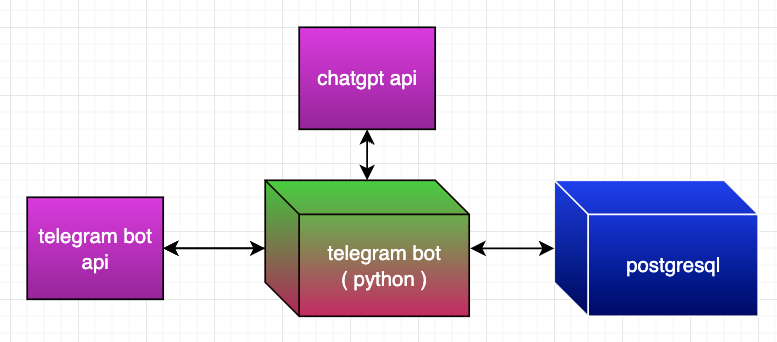

# 🎉 Welcome to Productivity Rate Telegram Bot! 🎉

## 🏗️ Architecture

This diagram illustrates the architecture of the Productivity Rate Telegram Bot. The bot integrates with multiple APIs and a PostgreSQL database to provide a seamless user experience.

- **Telegram Bot API**: Handles communication between the bot and Telegram users.
- **Telegram Bot (Python)**: Core logic of the bot implemented in Python.
- **ChatGPT API**: Provides natural language understanding and processing.
- **PostgreSQL**: Stores user data, logs, and productivity scores.

## 🚀 Overview

Welcome to the **Productivity Rate Telegram Bot**! This bot helps you track and rate your daily productivity in a fun and interactive way. Simply describe your day's activities, and the bot will give you a productivity score between 0 and 10. 📈

## 🛠 Features

- 📊 **Daily Productivity Scoring**: Get instant feedback on your daily productivity.
- 🔔 **Reminders**: Set daily reminders to log your activities.
- 📅 **History Tracking**: View your productivity trends over time.
- 💬 **Interactive Commands**: Easy-to-use commands for a seamless experience.
